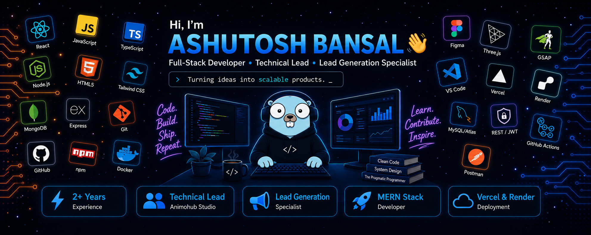

<!-- header image -->

<!-- intro name -->
<h1 align="center">Hi, I'm <a href="https://linkedin.com/in/meashutoshbansal" target="_blank">ASHUTOSH BANSAL</a> </h1>

<b>Hello</b>, pleased to meet you Stranger!

I'm Ashutosh, a final-year B.Tech Computer Science (Data Science) student at KCC Institute of Technology and Management, Greater Noida, with hands-on experience building full-stack MERN applications and running lead-generation systems for real clients.

Currently serving as <b>Technical Lead at Animohub Studio</b>, a digital and lead-generation agency, where I handle web development, outreach infrastructure, and client delivery. Looking forward to a full-time <b>MERN Stack Developer</b> role. ⚡

<b>What I'm building:</b> My final year project is an <b>Orbital Mechanics & Rocket Trajectory Simulator</b> — a full-stack application combining a Python physics engine (multi-body gravity simulation, RK4 integration, delta-V estimation), a React + Three.js 3D visualization layer, and live NASA/JPL Horizons data. 🚀

<b>Agency work:</b> At Animohub Studio, I've built and shipped client sites (React 19, Vite, Three.js, GSAP), and set up multi-channel outreach systems spanning cold email and social outreach across several client accounts.

<h3 align="center">MERN Stack Developer | Lead Generation & Outreach Specialist | Full-Stack Enthusiast</h3>

<h3>

</h3>

<h1>Technical Skills 🛠</h1>

I work primarily as a full-stack MERN developer with a strong front-end/visualization focus, and I've picked up deployment, lead-gen tooling, and data-driven project work along the way.

<h1 align="center">Projects</h1>

| Project Name | Description |
| :---: | :--- |
| [Google Maps Lead Scraper](https://github.com/Ashutosh-Bansal-04/GoogleMaps_Lead_Scraper) | Automates Google Maps searches to extract business leads — name, address, phone & website. |
| [Levare Digital](https://github.com/Ashutosh-Bansal-04/Levare-Digital) | Client website for Animohub Studio built with React 19, Vite, Three.js, and GSAP animations. |
| [Orbital Mechanics & Rocket Trajectory Simulator](https://github.com/Ashutosh-Bansal-04/orbital-mechanics-simulator) | Final year project — Python physics engine (RK4 multi-body gravity simulation, trajectory prediction, delta-V/fuel estimation) with a React + Three.js 3D visualization layer, integrated with NASA/JPL Horizons data. |
| [3W Full Stack Internship Assignment](https://github.com/Ashutosh-Bansal-04/3W-Full-Stack-Internship-Assignment) | Mini Social Post App built for a MERN stack internship assignment — React frontend deployed on Vercel, Node/Express backend deployed on Render, MongoDB Atlas. |

<h1 align="center">Let's Get Connected</h1>

I'm currently job-hunting for MERN stack internships/roles and building out Animohub Studio's client and lead-gen operations. Always happy to connect with other developers, founders, or anyone working on space/simulation projects. 🚀

<table>
  <tr>
    <td></td>
    <td></td>
  </tr>
</table>

